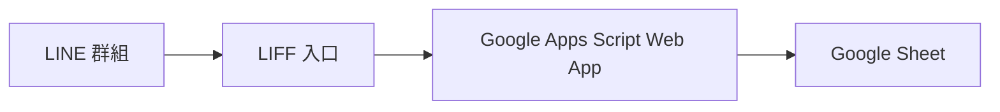

# 543 捐款回報專案

這個專案是 Google Apps Script Web App 起始版，對應目前討論的流程：

## 功能範圍

- 代表人從 LINE/LIFF 入口進入捐款登記頁。
- 選擇開放個案。
- 一筆登記可包含多位捐款人。
- 自動產生登記編號，例如 `E105-001`。
- 後台可查看所有登記、確認付款入帳、標記收據已處理。
- Google Sheet 作為資料庫，分頁名稱與欄位皆使用中文。

## Google Sheet 分頁

- `個案清單`：個案編號、個案名稱、目標金額、目前登記金額、是否開放、狀態、備註、建立時間、更新時間。
- `捐款登記總表`：保留所有登記的彙整資料，方便備份與全域查詢。
- `E105_捐款登記`、`E106_捐款登記` 等：每個個案各自一張登記表，管理人員查單一專案時不會混在一起。

每張捐款登記表都使用同一組中文欄位：登記編號、個案編號、代表人姓名、代表人手機、總金額、付款方式、捐款芳名清單、是否需要收據、收據狀態、付款狀態、入帳日期、收據編號、收據日期、登記時間、更新時間、LINE使用者ID、LINE顯示名稱、備註。

## 檔案

- `Code.gs`：Google Sheet 初始化、資料讀寫、後台更新 API。
- `Index.html`：Web App 主頁。
- `Styles.html`：頁面樣式。
- `JavaScript.html`：前台與後台互動邏輯。
- `appsscript.json`：Apps Script 專案設定。
- `SETUP.md`：部署與 LIFF 設定步驟。
